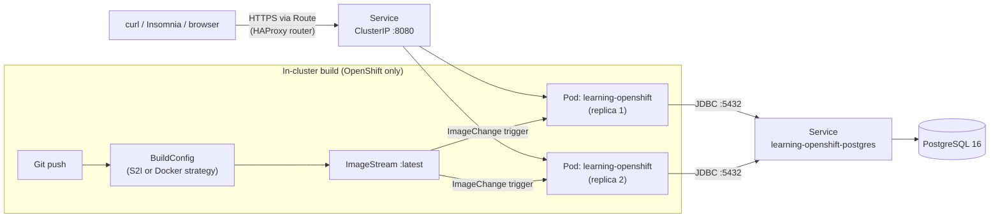
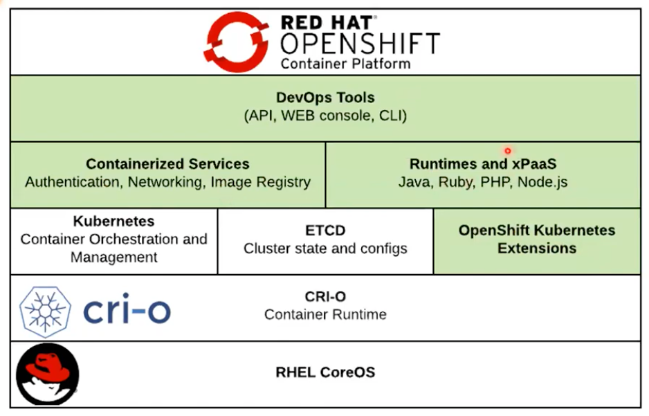
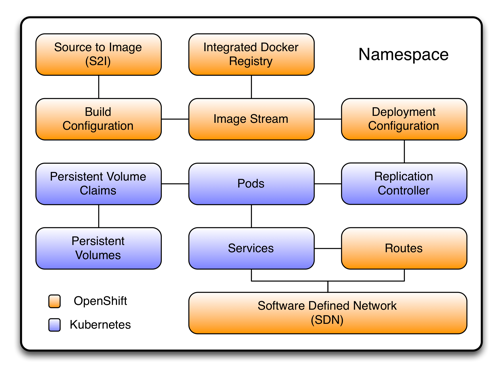
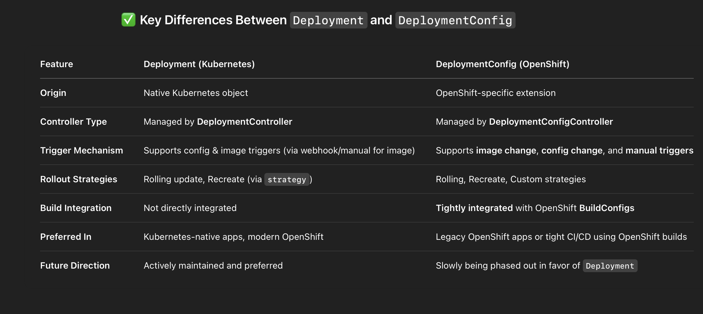
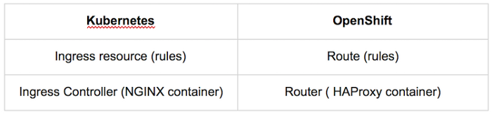

# <span style="color:hsl(217,80%,58%)">learning-openshift</span>

<p>Spring Boot Book CRUD microservice — a deliberately simple app used as a vehicle to learn
<strong>OpenShift</strong> in depth, and to understand precisely how it differs from a
self-managed <strong>Kubernetes</strong> cluster (<code>kops</code>, <code>kubeadm</code>),
a managed cloud Kubernetes service (<strong>Amazon EKS</strong>), and the older PaaS model
(<strong>Pivotal/VMware Tanzu Cloud Foundry</strong>).</p>

## <span style="color:hsl(355,80%,58%)">Table of Contents</span>

1. 🎯 [Purpose of this repo](#1-purpose-of-this-repo)
2. 🧰 [Stack](#2-stack)
3. 🏗️ [Architecture](#3-architecture)
4. 🚀 [Quick Start](#4-quick-start)
5. 📖 [REST API Reference](#5-rest-api-reference)
6. 🧪 [Testing Strategy](#6-testing-strategy)
7. 📁 [Project Structure](#7-project-structure)
8. 🔨 [Command Reference — everything used to build/run/test this repo](#8-command-reference--everything-used-to-buildruntest-this-repo)
9. ☸️ [OpenShift Deep Dive](#9-openshift-deep-dive)
   - 9.1 [What OpenShift actually is](#91-what-openshift-actually-is)
   - 9.2 [OpenShift architecture](#92-openshift-architecture)
   - 9.3 [OpenShift vs vanilla Kubernetes](#93-openshift-vs-vanilla-kubernetes)
   - 9.4 [OpenShift vs Amazon EKS](#94-openshift-vs-amazon-eks)
   - 9.5 [OpenShift vs self-managed Kubernetes (kops/kubeadm)](#95-openshift-vs-self-managed-kubernetes-kopskubeadm)
   - 9.6 [OpenShift vs Pivotal/VMware Tanzu Cloud Foundry (PCF)](#96-openshift-vs-pivotalvmware-tanzu-cloud-foundry-pcf)
   - 9.7 [Security Context Constraints (SCC) deep dive](#97-security-context-constraints-scc-deep-dive)
   - 9.8 [Routes vs Ingress vs AWS ALB](#98-routes-vs-ingress-vs-aws-alb)
   - 9.9 [Builds: BuildConfig, S2I, ImageStream](#99-builds-buildconfig-s2i-imagestream)
   - 9.10 [DeploymentConfig vs Deployment](#910-deploymentconfig-vs-deployment)
   - 9.11 [Templates vs Helm vs Kustomize](#911-templates-vs-helm-vs-kustomize)
   - 9.12 [Multi-tenancy: Project vs Namespace](#912-multi-tenancy-project-vs-namespace)
   - 9.13 [Operators and OLM](#913-operators-and-olm)
   - 9.14 [Networking: OVN-Kubernetes vs AWS VPC CNI](#914-networking-ovn-kubernetes-vs-aws-vpc-cni)
   - 9.15 [Decision matrix — which platform, when](#915-decision-matrix--which-platform-when)
10. 📦 [OpenShift Manifest Reference (`openshift/`)](#10-openshift-manifest-reference-openshift)
11. 🩺 [Probes & Observability](#11-probes--observability)
12. 🔧 [`oc` CLI Command Reference](#12-oc-cli-command-reference)
13. 🐛 [Troubleshooting](#13-troubleshooting)
14. 🔗 [References](#14-references)
15. 💬 [Interview talking points](#15-interview-talking-points)

---

<a id="1-purpose-of-this-repo"></a>
## <span style="color:hsl(132,80%,58%)">1. 🎯 Purpose of this repo</span>

<ul>

- The **application code is intentionally boring**: five CRUD endpoints over one `Book`
  entity, backed by Postgres via Spring Data JPA, with Flyway migrations. There is no
  business complexity here worth learning from.
- The **actual subject matter is everything under [`openshift/`](openshift/)** — a
  from-scratch, hand-written (not `oc new-app`-generated) set of manifests covering every
  major OpenShift-specific resource kind, annotated with *why* it exists and *how it differs*
  from the closest Kubernetes/EKS/PCF equivalent.
- Section 9 below is the long-form write-up: what OpenShift is, how it's architected, and a
  head-to-head comparison against vanilla Kubernetes, Amazon EKS, self-managed Kubernetes
  (`kops`/`kubeadm`), and Pivotal/VMware Tanzu Cloud Foundry — the four platforms most likely
  to come up in an interview or a real platform-selection conversation.
- Cross-reference: [learning-k8s-openshift.md](https://github.com/himnay/learning/blob/main/learning-k8s-openshift.md) in the
  wiki repo covers the same ground in Q&A/interview-prep form; this README is the deeper,
  narrative version with a real running app backing every claim.

</ul>

---

<a id="2-stack"></a>
## <span style="color:hsl(270,80%,58%)">2. 🧰 Stack</span>

| Component        | Version / Detail                                  |
|-------------------|-----------------------------------------------------|
| Java              | 25                                                 |
| Spring Boot       | 4.1.1 (via [super-pom](https://github.com/himnay/super-pom) 1.1.3, as of 2026) |
| Spring Framework  | 7.0.9                                              |
| Database          | PostgreSQL 16                                      |
| ORM               | Spring Data JPA (Hibernate 7.4.5)                  |
| Migrations        | Flyway 12.4                                        |
| Validation        | Jakarta Bean Validation (`@NotBlank`, `@DecimalMin`, …) |
| Error model       | RFC 9457 `ProblemDetail` via `@RestControllerAdvice` |
| Observability     | Spring Boot Actuator + Micrometer + Prometheus registry |
| JSON              | Jackson 3 (`tools.jackson`) — new coordinates in Spring Boot 4.1 |
| Tests             | JUnit 5, Mockito, AssertJ, MockMvc, Testcontainers |
| Build             | Maven 3.9+ (no wrapper — matches sibling repos)     |
| Container runtime target | OpenShift (CRC locally) / any conformant Kubernetes |

---

<a id="3-architecture"></a>
## <span style="color:hsl(47,80%,50%)">3. 🏗️ Architecture</span>



Locally (this repo's default dev loop), the Route/Service/BuildConfig/ImageStream layer is
replaced entirely by `docker-compose.yml` (Postgres only) + `mvn spring-boot:run` — the app
itself doesn't know or care whether it's running under Docker Compose, plain `java -jar`, or
inside an OpenShift pod. That portability is the point: **only the platform layer changes**,
covered in [Section 9](#9-openshift-deep-dive).

---

<a id="4-quick-start"></a>
## <span style="color:hsl(185,80%,58%)">4. 🚀 Quick Start</span>

### <span style="color:hsl(322,80%,58%)">4.1 Local (Docker Compose + `mvn spring-boot:run`)</span>

```bash
# 1. Start Postgres
docker compose up -d

# 2. Run the app (Flyway migrates the schema automatically on startup)
mvn spring-boot:run

# 3. Verify
curl http://localhost:8080/actuator/health
```

### <span style="color:hsl(100,80%,58%)">4.2 On OpenShift (CRC — CodeReady Containers, local single-node cluster)</span>

```bash
# 1. Install & start a local OpenShift cluster (one-time setup)
crc setup
crc start

# 2. Log in and create a Project (OpenShift's namespace wrapper — see §9.12)
oc login -u developer https://api.crc.testing:6443
oc new-project learning-openshift

# 3. Apply the whole manifest set
oc apply -f openshift/configmap.yaml
oc apply -f openshift/secret.yaml
oc apply -f openshift/imagestream.yaml
oc apply -f openshift/imagestream-java-builder.yaml
oc apply -f openshift/buildconfig-s2i.yaml
oc apply -f openshift/deployment.yaml
oc apply -f openshift/service.yaml
oc apply -f openshift/route.yaml

# 4. Trigger the first build (pulls source, builds, pushes to the ImageStream)
oc start-build learning-openshift-s2i --follow

# 5. Get the public URL
oc get route learning-openshift -o jsonpath='{.spec.host}'
```

### <span style="color:hsl(237,80%,58%)">4.3 Or via the Template (one command, parameterized)</span>

```bash
oc process -f openshift/template.yaml \
  -p APP_NAME=learning-openshift \
  -p GIT_URI=https://github.com/himnay/learning-openshift.git \
  | oc apply -f -
```

---

<a id="5-rest-api-reference"></a>
## <span style="color:hsl(15,80%,58%)">5. 📖 REST API Reference</span>

Base path: `/api/v1/books`

| Method | Path                | Body           | Success | Notes                                    |
|--------|----------------------|-----------------|---------|-------------------------------------------|
| POST   | `/api/v1/books`      | `BookRequest`   | `201`   | `Location` header set; `409` on duplicate isbn |
| GET    | `/api/v1/books`      | —               | `200`   | Returns full list                         |
| GET    | `/api/v1/books/{id}` | —               | `200`   | `404` if not found                        |
| PUT    | `/api/v1/books/{id}` | `BookRequest`   | `200`   | Full replace; `404`/`409` as above        |
| DELETE | `/api/v1/books/{id}` | —               | `204`   | `404` if not found                        |

`BookRequest`:

```json
{
  "title": "Clean Architecture",
  "author": "Robert C. Martin",
  "isbn": "978-0134494166",
  "price": 34.99,
  "publishedYear": 2017
}
```

Validation errors and business errors both come back as
[RFC 9457](https://www.rfc-editor.org/rfc/rfc9457) `application/problem+json`:

```json
{
  "detail": "Validation failed",
  "instance": "/api/v1/books",
  "status": 400,
  "title": "Invalid request body",
  "type": "https://learning-openshift/errors/validation",
  "errors": { "title": "title is required" }
}
```

### <span style="color:hsl(152,80%,58%)">5.1 Live curl walkthrough (verified end-to-end against this exact codebase)</span>

```bash
BASE=http://localhost:8080/api/v1/books

# Create
curl -s -X POST "$BASE" -H "Content-Type: application/json" \
  -d '{"title":"Clean Architecture","author":"Robert C. Martin","isbn":"978-0134494166","price":34.99,"publishedYear":2017}'
# -> 201 {"id":1,...}

# Read one
curl -s "$BASE/1"

# List
curl -s "$BASE"

# Update
curl -s -X PUT "$BASE/1" -H "Content-Type: application/json" \
  -d '{"title":"Clean Architecture (2nd)","author":"Robert C. Martin","isbn":"978-0134494166","price":39.99,"publishedYear":2018}'

# Duplicate isbn -> 409
curl -s -X POST "$BASE" -H "Content-Type: application/json" \
  -d '{"title":"Dup","author":"X","isbn":"978-0134494166","price":9.99,"publishedYear":2020}'

# Invalid body -> 400
curl -s -X POST "$BASE" -H "Content-Type: application/json" \
  -d '{"title":"","author":"","isbn":"","price":-1}'

# Delete
curl -s -X DELETE "$BASE/1"

# Read after delete -> 404
curl -s "$BASE/1"
```

---

<a id="6-testing-strategy"></a>
## <span style="color:hsl(290,80%,58%)">6. 🧪 Testing Strategy</span>

| Layer                    | Class                          | What it proves                                                        | Spring context loaded? |
|---------------------------|----------------------------------|--------------------------------------------------------------------------|--------------------------|
| Unit                      | `BookServiceTest`               | Business logic in isolation — repository mocked via Mockito             | No                       |
| Web slice                 | `BookControllerWebMvcTest`      | HTTP layer — status codes, JSON shape, validation wiring — service mocked | Partial (`@WebMvcTest`) |
| Repository slice          | `BookRepositoryDataJpaTest`     | JPA mappings, unique constraint, query methods — real Postgres container | Partial (`@DataJpaTest`) |
| Full integration          | `BookControllerIT`              | Entire CRUD lifecycle over real HTTP + real Postgres + real Flyway      | Full (`@SpringBootTest`) |
| Context load              | `OpenshiftApplicationTests`     | Application context assembles cleanly end to end                        | Full (`@SpringBootTest`) |

All Postgres-backed tests share one Testcontainers container per JVM fork via
`support/AbstractIntegrationTest` (`@Container @ServiceConnection`) — no manual JDBC URL wiring,
no `@DynamicPropertySource` boilerplate per test class.

```bash
mvn test
```

25 tests, 0 failures, as of the last verified run of this repo.

---

<a id="7-project-structure"></a>
## <span style="color:hsl(67,80%,50%)">7. 📁 Project Structure</span>

```
learning-openshift/
├── pom.xml                          # parent = com.org.llm:super-pom (imports learning-bom)
├── docker-compose.yml               # Postgres only — local dev loop
├── Dockerfile                       # used by openshift/buildconfig-docker.yaml
├── src/main/java/com/org/openshift/
│   ├── OpenshiftApplication.java
│   ├── model/Book.java              # JPA entity
│   ├── dto/{BookRequest,BookResponse}.java   # records
│   ├── repository/BookRepository.java
│   ├── service/BookService.java
│   ├── controller/BookController.java
│   └── exception/{GlobalExceptionHandler,ResourceNotFoundException,DuplicateResourceException}.java
├── src/main/resources/
│   ├── application.yml
│   ├── banner.txt
│   ├── logback-spring.xml
│   └── db/migration/V1__create_books_table.sql
├── src/test/java/com/org/openshift/...     # see §6
└── openshift/                        # see §10 — the actual subject of this repo
```

---

<a id="8-command-reference--everything-used-to-buildruntest-this-repo"></a>
## <span style="color:hsl(205,80%,58%)">8. 🔨 Command Reference — everything used to build/run/test this repo</span>

### <span style="color:hsl(342,80%,58%)">8.1 Maven</span>

| Command                              | Purpose                                                             |
|----------------------------------------|-------------------------------------------------------------------------|
| `mvn compile`                        | Compile main sources                                                |
| `mvn test-compile`                   | Compile test sources without running them                           |
| `mvn test`                           | Run the full test suite (unit + slice + Testcontainers IT)          |
| `mvn spring-boot:run`                | Run the app locally (reads `application.yml`, profile `local`)      |
| `mvn clean package`                  | Produce the runnable fat jar in `target/`                            |
| `mvn clean install`                  | Package + install to the local `~/.m2` repository                    |
| `mvn dependency:tree`                | Print the fully resolved dependency graph                            |
| `mvn flyway:info`                    | Show applied vs pending Flyway migrations                            |
| `mvn verify -Psecurity-scan`         | OWASP dependency-check (inherited opt-in profile from `super-pom`)   |
| `mvn test -Pmutation-test`           | PIT mutation testing (inherited opt-in profile from `super-pom`)     |

### <span style="color:hsl(120,80%,58%)">8.2 Docker / Docker Compose</span>

| Command                       | Purpose                                  |
|---------------------------------|-----------------------------------------|
| `docker compose up -d`        | Start Postgres in the background          |
| `docker compose ps`           | Check container health                    |
| `docker compose down`         | Stop and remove the Postgres container/network |
| `docker build --build-context m2=$HOME/.m2/repository/com/org -t learning-openshift .` | Build the image locally, mirroring `buildconfig-docker.yaml`. The named context supplies the parent POMs (`super-pom`, `learning-bom`), which are not on Maven Central — in-cluster builds need them in an internal Maven repo |

### <span style="color:hsl(257,80%,58%)">8.3 Git (setup performed for this repo)</span>

| Command                                            | Purpose                                                        |
|-------------------------------------------------------|----------------------------------------------------------------|
| `git init`                                          | Initialize the repo                                             |
| `git add -A && git commit -m "..."`                 | Initial scaffold commit — required for `git-commit-id-maven-plugin` to resolve `HEAD` (the build fails without at least one commit) |

### <span style="color:hsl(35,80%,58%)">8.4 `curl` (see [§5.1](#51-live-curl-walkthrough-verified-end-to-end-against-this-exact-codebase) for the full CRUD walkthrough)</span>

### <span style="color:hsl(172,80%,58%)">8.5 `oc` — see the [dedicated section, §12](#12-oc-cli-command-reference)</span>

---

<a id="9-openshift-deep-dive"></a>
## <span style="color:hsl(310,80%,58%)">9. ☸️ OpenShift Deep Dive</span>

<a id="91-what-openshift-actually-is"></a>
### <span style="color:hsl(87,80%,58%)">9.1 What OpenShift actually is</span>

Red Hat OpenShift Container Platform (OCP) is a Kubernetes *distribution*: it runs an
upstream-conformant Kubernetes control plane underneath, then layers on a curated,
opinionated, and — critically — **integrated-by-default** set of components that on any
other Kubernetes (including EKS) you would otherwise assemble yourself from a dozen
separate CNCF projects and vendor add-ons: an in-cluster CI build system, an integrated
container registry, a router/ingress layer, a stricter security model, a web console, and
a package manager for cluster-scoped software (Operators/OLM).

The mental model that holds up best in practice: **if Kubernetes is the engine, OpenShift
is a fully assembled vehicle built around that engine** — dashboard, safety systems, and a
support contract included. Nothing in a plain Kubernetes YAML manifest becomes invalid on
OpenShift (it's still real Kubernetes underneath); what changes is *how much you have to
bring yourself* versus *how much ships in the box*.

<a id="92-openshift-architecture"></a>
### <span style="color:hsl(225,80%,58%)">9.2 OpenShift architecture</span>



Control-plane-level, the notable OpenShift-specific pieces on top of standard Kubernetes are:

<ul>

- **API server aggregation layer** — OpenShift's own resource kinds (`Route`,
  `BuildConfig`, `DeploymentConfig`, `ImageStream`, `SecurityContextConstraints`,
  `Project`, `Template`) are registered as additional API groups
  (`route.openshift.io`, `build.openshift.io`, `apps.openshift.io`,
  `image.openshift.io`, `security.openshift.io`, `project.openshift.io`,
  `template.openshift.io`) served by the same `kube-apiserver` binary process,
  aggregated alongside the standard `apps/v1`, `v1`, `networking.k8s.io/v1` groups —
  `oc get`/`kubectl get` against either surface talk to the same API server.
- **Integrated container image registry** running in-cluster, backing every
  `ImageStream` — no external registry (ECR, Docker Hub, Quay) is *required*, though any
  of them can be used instead/alongside.
- **HAProxy-based router** (or OpenShift's newer Ingress Operator managing it) fronting
  every `Route`.
- **Machine Config Operator / Machine API** managing node lifecycle when running on
  Red Hat CoreOS (RHCOS) nodes — immutable, transactionally-updated OS images, entirely
  managed by the cluster itself (`rpm-ostree` under the hood) rather than a
  human-run `apt`/`yum` upgrade.
- **Operator Lifecycle Manager (OLM)** and the embedded OperatorHub catalog — see
  [§9.13](#913-operators-and-olm).

</ul>

<a id="93-openshift-vs-vanilla-kubernetes"></a>
### <span style="color:hsl(2,80%,58%)">9.3 OpenShift vs vanilla Kubernetes</span>



| Concern                     | Vanilla Kubernetes                                   | OpenShift                                                                 |
|-------------------------------|---------------------------------------------------------|-----------------------------------------------------------------------------|
| Ingress/external routing    | `Ingress` + a controller you install (nginx, Traefik, …) | Built-in `Route` object + HAProxy router, always present                   |
| Pod security                | Pod Security Admission (PSA) labels: `privileged`/`baseline`/`restricted` — opt-in, permissive by default | `SecurityContextConstraints` (SCC) — enforced from cluster install; default `restricted-v2` denies root, arbitrary capabilities, host access |
| In-cluster CI/build         | None built-in — bring Tekton/Argo/Jenkins yourself      | `BuildConfig` + Source-to-Image (S2I) or Docker strategy, built in         |
| Container registry          | None built-in — bring ECR/Docker Hub/Harbor/Quay        | Integrated registry + `ImageStream` (a movable alias over image tags), built in |
| Auto-redeploy on new image  | Not built-in — needs a GitOps controller (Argo CD/Flux) watching the tag | `ImageChangeTrigger` on `DeploymentConfig` (or on a `Deployment` via a separate trigger object) — built in |
| Namespace + access wrapper  | `Namespace` (flat, no access-control envelope)          | `Project` = `Namespace` + baked-in RBAC/quota scaffolding, self-service via `oc new-project` |
| Packaged cluster software   | Manually apply CRDs + controllers, or use Helm          | Operator Lifecycle Manager (OLM) + OperatorHub catalog, built in           |
| Templating                  | Helm / Kustomize (third-party, install yourself)         | `Template` objects, built into the API (`oc process`) — Helm also works fine |
| Web console                 | Not built-in (install the Kubernetes Dashboard separately) | Full-featured web console, built in                                       |
| CLI                          | `kubectl`                                              | `oc` (superset — every `kubectl` verb works, plus OpenShift-only ones)     |

Practical cost of the extra structure: switching an application *off* OpenShift means
reworking anything that used `Route`, `BuildConfig`, `ImageStream`, `DeploymentConfig`, or a
custom `SCC` back into portable primitives (`Ingress`, an external CI pipeline, an external
registry, `Deployment`, Pod Security Admission labels) — this repo deliberately keeps the
*application* itself 100% portable (plain `Deployment`/`Service` variants are included
alongside the OpenShift-only ones) so only the *platform* layer needs rework, not the app.

<a id="94-openshift-vs-amazon-eks"></a>
### <span style="color:hsl(140,80%,58%)">9.4 OpenShift vs Amazon EKS</span>

This is the comparison most relevant to a working engineer choosing where a service
actually runs in production.

| Concern                    | Amazon EKS                                                        | OpenShift (self-hosted OCP, or ROSA — Red Hat OpenShift Service on AWS) |
|-------------------------------|------------------------------------------------------------------------|------------------------------------------------------------------------------|
| Control plane                | Fully managed by AWS; you never see/patch master nodes                 | Self-hosted OCP: you own control-plane nodes (or use IPI to automate their lifecycle). ROSA: AWS + Red Hat jointly manage it, closer to EKS's model |
| Worker node OS               | Amazon Linux 2023 or Bottlerocket (immutable, container-optimized)     | Red Hat CoreOS (RHCOS) — also immutable/transactional, managed by the in-cluster Machine Config Operator |
| Ingress / external routing   | AWS Load Balancer Controller provisioning an ALB/NLB per `Ingress`/`Service` — real AWS cost per LB | Built-in HAProxy `Route` — one shared router pool fronts many Routes, no per-app cloud LB cost by default |
| Container registry           | Amazon ECR — external, IAM-authenticated                               | Integrated in-cluster registry + `ImageStream`, or ECR if preferred          |
| CI/CD for image builds       | Not built-in — CodeBuild/CodePipeline/GitHub Actions, external to the cluster | `BuildConfig` (S2I/Docker strategy) runs the build *inside* the cluster, no external CI system strictly required |
| Pod-level AWS access         | IAM Roles for Service Accounts (IRSA) / EKS Pod Identity — scoped AWS API credentials injected per pod | No equivalent concept — OpenShift has no opinion about a specific cloud's IAM; cloud credentials are handled the same way any k8s workload does (mounted Secrets, or the Cloud Credential Operator on OpenShift's own cloud-integration layer) |
| Pod security enforcement     | Pod Security Admission only if you turn it on; nothing blocks root by default unless you add Kyverno/OPA/PSA labels yourself | `SecurityContextConstraints` — enforced from day one, every ServiceAccount bound to `restricted-v2` unless explicitly elevated |
| Autoscaling                  | Cluster Autoscaler or Karpenter (fast, AWS-native bin-packing) provisioning EC2 capacity | MachineAutoscaler + MachineSets (Machine API) — conceptually similar, generally considered slower to provision than Karpenter |
| Networking / CNI             | AWS VPC CNI by default — pods get real VPC IP addresses, tightly coupled to AWS networking; NetworkPolicy needs an add-on (Calico/Cilium) to be enforced at all | OVN-Kubernetes (default since OCP 4.12) — overlay networking, cloud-agnostic, NetworkPolicy enforced natively out of the box |
| Multi-tenancy                | `Namespace` + manually-authored `ResourceQuota`/RBAC — no batteries included | `Project` — self-service creation, quota/RBAC scaffolding applied automatically per Project |
| Cost model                   | ~$0.10/hr per cluster control plane + EC2/Fargate compute — pay AWS directly, no platform licensing fee | Red Hat subscription (per-core or per-node) on top of infrastructure cost, *unless* running OKD (the free upstream community distribution) or ROSA's bundled pricing |
| Portability                  | AWS-specific by construction (VPC CNI, ALB controller, IRSA, ECR are all AWS APIs) | Designed to run identically on AWS (ROSA), Azure (ARO), GCP, bare metal, or fully on-prem — the same manifests move with minimal change |
| Best fit                     | AWS-committed teams who want the lowest operational overhead and deepest AWS service integration | Regulated/hybrid/multi-cloud environments, or teams that want the security/build/registry stack unified and vendor-supported rather than assembled from separate tools |

<a id="95-openshift-vs-self-managed-kubernetes-kopskubeadm"></a>
### <span style="color:hsl(277,80%,58%)">9.5 OpenShift vs self-managed Kubernetes (kops/kubeadm)</span>

`kops` (and `kubeadm` underneath most self-managed setups) provisions and manages the
Kubernetes control plane itself — VMs, etcd, the API server — with your team owning every
subsequent upgrade, security patch, and add-on.

| Concern                | kops / kubeadm self-managed                                                | OpenShift (IPI-installed)                                                    |
|--------------------------|--------------------------------------------------------------------------------|------------------------------------------------------------------------------|
| Initial install          | Manual/scripted; deep control over every parameter (instance types, CNI choice, HA topology) | Installer-Provisioned Infrastructure (IPI) automates the entire cluster bring-up on supported clouds; User-Provisioned Infrastructure (UPI) available for full manual control when needed |
| Ongoing upgrades         | Team-driven; `kops upgrade cluster` + careful sequencing, historically prone to surprises | Cluster-driven, transactional OS + component upgrades via the Cluster Version Operator — designed to be a mostly unattended "click upgrade" |
| Security defaults        | None — you decide and configure PSA, network policy, RBAC from scratch      | `SCC`, RBAC scaffolding, network policy enforcement all present from cluster creation |
| Add-on ecosystem         | You choose and wire together every piece (ingress controller, registry, CI, monitoring, logging) | Ships pre-integrated: router, registry, monitoring stack (Prometheus/Grafana/Alertmanager), logging stack, OLM — all present, individually toggle-able |
| Support model            | Community support only, unless a separate support contract is purchased for a specific add-on | Red Hat subscription includes support for the *entire* stack as one product |
| Cost                     | Lowest — only infrastructure cost, zero platform licensing                  | Infrastructure cost + Red Hat subscription (or free via OKD, the upstream community build) |
| Best fit                 | Teams with strong platform engineering who want maximum control and zero platform licensing cost | Teams who want a single vendor-supported, pre-integrated platform and are willing to pay for that integration and support |

<a id="96-openshift-vs-pivotalvmware-tanzu-cloud-foundry-pcf"></a>
### <span style="color:hsl(55,80%,50%)">9.6 OpenShift vs Pivotal/VMware Tanzu Cloud Foundry (PCF)</span>

PCF (now VMware Tanzu Application Service) predates the Kubernetes-container era and is
architecturally a different animal entirely, not just a different Kubernetes distribution.

| Concern                | PCF / Tanzu Application Service                                          | OpenShift                                                                 |
|--------------------------|--------------------------------------------------------------------------|----------------------------------------------------------------------------|
| Core abstraction          | **PaaS** — `cf push` a buildpack-detected app; no Dockerfile, no YAML, no container knowledge required | **Container platform** — you ship a container image (or let S2I build one); Kubernetes primitives (Pod, Service, Deployment) are first-class and visible |
| Underlying architecture   | Custom: Diego scheduler + Warden/`runC` containers, BOSH for VM lifecycle — predates Kubernetes | Kubernetes-native throughout — the exact same `Pod`/container model the rest of the industry standardized on |
| Developer experience      | Extremely low-friction for a supported buildpack app (`cf push` and done) — but opaque and hard to customize outside the buildpack's assumptions | More moving parts to learn (YAML, `oc`/`kubectl`, container concepts) but full control and Kubernetes-portable |
| Portability of skills/artifacts | PCF-specific — a `cf push`-deployed app and its buildpack config don't transfer to any other platform | A container image + Kubernetes manifests transfer to *any* conformant Kubernetes, including EKS, GKE, AKS, or plain kops — this is the single biggest practical advantage OpenShift (and Kubernetes generally) holds over PCF today |
| Market trajectory (2026)  | Declining — industry mindshare for Pivotal Cloud Foundry fell from ~9.9% to ~5.1% year-over-year as of mid-2026 (PeerSpot category tracking); Broadcom's 2023 VMware acquisition further clouded Tanzu's roadmap and licensing | Also declined somewhat over the same window (~12.0% → ~6.9%) as plain managed Kubernetes (EKS/GKE/AKS) has absorbed share, but remains the dominant *enterprise* Kubernetes distribution |
| Strongest use case         | Regulated enterprises (banking/insurance) already deeply invested in Spring + buildpacks who value `cf push` simplicity and don't need container-level control | Anyone needing container-level control, Kubernetes-standard portability, or migrating *off* Cloud Foundry toward the Kubernetes ecosystem |

The practical takeaway for a Spring Boot engineer: this project's `Dockerfile` +
`openshift/deployment.yaml` pair is the "how would I containerize and ship this on
Kubernetes" answer; the PCF equivalent would have been `cf push` with a `manifest.yml` and
no container image at all — genuinely different mental models, not just different YAML
dialects.

<a id="97-security-context-constraints-scc-deep-dive"></a>
### <span style="color:hsl(192,80%,58%)">9.7 Security Context Constraints (SCC) deep dive</span>

See [`openshift/scc.yaml`](openshift/scc.yaml) for a fully commented example. Key points:

<ul>

- SCCs are bound to a **ServiceAccount** (or user/group), never referenced from a `Pod`
  spec directly. At admission time, OpenShift picks the highest-priority SCC the pod's SA
  is authorized to use and applies its constraints — and its *defaulting* (e.g. assigning
  a UID from the namespace's allocated range) — to the pod.
- The default `restricted-v2` SCC (bound to every authenticated SA since OCP 4.11) already
  forces: no root, no privilege escalation, all Linux capabilities dropped, no host
  namespace access, an SELinux context assigned per-namespace. A plain Spring Boot
  container (like this one) satisfies it with zero extra configuration.
- This is **strictly more restrictive by default** than Kubernetes' own Pod Security
  Admission, which is opt-in and, even at its `restricted` level, doesn't cover everything
  an SCC does (e.g. SCC's `runAsUser: MustRunAsRange` allocation is OpenShift-specific;
  nothing in vanilla PSA assigns a UID for you).
- On EKS, the closest analogue for controlling *cloud* access is IRSA/Pod Identity — but
  that's a completely different axis (AWS API permissions), not container-level Linux
  security (UID, capabilities, host access). EKS needs Pod Security Admission *and*
  IRSA/Pod Identity to cover what one SCC covers on OpenShift.

</ul>

<a id="98-routes-vs-ingress-vs-aws-alb"></a>
### <span style="color:hsl(330,80%,58%)">9.8 Routes vs Ingress vs AWS ALB</span>

| | OpenShift `Route` | Kubernetes `Ingress` | EKS + AWS Load Balancer Controller |
|---|---|---|---|
| Controller | Built-in HAProxy router (or Ingress Operator) | You install one (nginx, Traefik, HAProxy…) | AWS Load Balancer Controller, provisions a real ALB/NLB |
| Cost per exposed app | Shared router pool — effectively free per additional Route | Depends on controller/infra | Real AWS $ per ALB/NLB, unless multiple Ingresses share one ALB via `IngressGroup` |
| Config surface | Simple: one host, one backend Service, TLS termination mode | Rule-based: paths, hosts, backends, `IngressClass` | Same as Ingress + AWS-specific annotations for target-group/health-check tuning |
| TLS termination modes | `edge`, `passthrough`, `reencrypt` — all first-class `spec.tls` fields | Controller-dependent | Controller-dependent (ALB supports similar modes via annotations) |

See [`openshift/route.yaml`](openshift/route.yaml) for this project's edge-TLS Route with
an HAProxy timeout override.

<a id="99-builds-buildconfig-s2i-imagestream"></a>
### <span style="color:hsl(107,80%,58%)">9.9 Builds: BuildConfig, S2I, ImageStream</span>

<ul>

- **`BuildConfig`** is an in-cluster CI job definition — no k8s/EKS equivalent; EKS needs an
  entirely separate system (CodeBuild, GitHub Actions, Jenkins) outside the cluster.
- **Source-to-Image (S2I)** ([`buildconfig-s2i.yaml`](openshift/buildconfig-s2i.yaml)) injects
  this repo's source straight into a builder image (`openjdk-25-ubi9`) that already knows how
  to `assemble`/`run` a Maven project — **no Dockerfile needed at all**.
- The **Docker strategy** ([`buildconfig-docker.yaml`](openshift/buildconfig-docker.yaml))
  builds this repo's own [`Dockerfile`](Dockerfile) in-cluster instead — full control, more
  boilerplate.
- **`ImageStream`** is a stable, movable alias over physical image locations — think "a
  branch pointer for container image tags." Both BuildConfigs above push to the same
  ImageStream's `:latest` tag; `DeploymentConfig`'s `ImageChangeTrigger`
  ([`deploymentconfig.yaml`](openshift/deploymentconfig.yaml)) watches that tag and
  auto-redeploys the instant a new image lands — with zero external GitOps controller.

</ul>

<a id="910-deploymentconfig-vs-deployment"></a>
### <span style="color:hsl(245,80%,58%)">9.10 DeploymentConfig vs Deployment</span>



`DeploymentConfig` is OpenShift's original, pre-`Deployment` workload API — **deprecated
since OCP 4.14** (security-fixes-only; use `Deployment` for new workloads), but this repo
ships both ([`deployment.yaml`](openshift/deployment.yaml) and
[`deploymentconfig.yaml`](openshift/deploymentconfig.yaml)) side by side specifically so the
diff is visible. The two things `DeploymentConfig` can do that `Deployment` genuinely
cannot: built-in `ImageChangeTrigger` (auto-redeploy on new image, no external controller),
and lifecycle hooks (`pre`/`mid`/`post` — run an arbitrary command in a fresh pod before
traffic cuts over).

<a id="911-templates-vs-helm-vs-kustomize"></a>
### <span style="color:hsl(22,80%,58%)">9.11 Templates vs Helm vs Kustomize</span>

`Template` ([`openshift/template.yaml`](openshift/template.yaml)) is a built-in API verb
(`oc process`) — every OpenShift cluster can process one with zero extra tooling installed.
Helm and Kustomize are both third-party CNCF tools that work identically well on OpenShift,
EKS, or any Kubernetes — and are far more common in the wider ecosystem today. Templates
remain relevant mainly for OpenShift's own "New App from Catalog" web-console flow, which
processes a Template under the hood.

<a id="912-multi-tenancy-project-vs-namespace"></a>
### <span style="color:hsl(160,80%,58%)">9.12 Multi-tenancy: Project vs Namespace</span>



A `Namespace` on plain Kubernetes has no access-control envelope of its own — any
authenticated cluster user can see every namespace and its resources unless RBAC is
layered on separately. A `Project` **is** a `Namespace`, plus: self-service creation
(`oc new-project`) that automatically provisions RBAC bindings scoping the creator to their
own Project, and (commonly) a `ResourceQuota`/`LimitRange` pair applied by policy — see
[`openshift/resourcequota.yaml`](openshift/resourcequota.yaml) and
[`openshift/limitrange.yaml`](openshift/limitrange.yaml). This matters more on OpenShift in
practice because OpenShift clusters are far more often genuinely multi-tenant (many teams'
Projects on one shared cluster) than a typical EKS cluster, which is more often
single-team/single-workload with capacity handled by the Cluster Autoscaler/Karpenter
instead of hard per-tenant quotas.

<a id="913-operators-and-olm"></a>
### <span style="color:hsl(297,80%,58%)">9.13 Operators and OLM</span>

The Operator Lifecycle Manager (OLM) and its bundled OperatorHub catalog let a cluster admin
install, upgrade, and manage cluster-scoped software (databases, message brokers, service
meshes, cert managers) as first-class, versioned, dependency-aware packages — comparable to
`apt`/`yum` for the cluster itself. OLM ships built into every OpenShift cluster; on EKS
you'd install OLM yourself (it's open source and works fine there too) or manage each
operator's CRDs/RBAC/upgrades by hand.

<a id="914-networking-ovn-kubernetes-vs-aws-vpc-cni"></a>
### <span style="color:hsl(75,80%,58%)">9.14 Networking: OVN-Kubernetes vs AWS VPC CNI</span>

OpenShift's default CNI (OVN-Kubernetes since OCP 4.12, OpenShift SDN before that) is an
overlay network — pod IPs are cluster-internal and cloud-agnostic — and **enforces
`NetworkPolicy` natively out of the box**. EKS's default VPC CNI instead gives every pod a
real, routable VPC IP address (tight AWS integration, useful for some security-group-based
designs) but does **not** enforce `NetworkPolicy` at all unless a separate CNI plugin
(Calico, Cilium) is layered on top. This project's
[`openshift/networkpolicy.yaml`](openshift/networkpolicy.yaml) works unmodified on
OpenShift; the same manifest applied on a stock EKS cluster would be silently accepted by
the API server and **enforce nothing** without Calico/Cilium installed.

<a id="915-decision-matrix--which-platform-when"></a>
### <span style="color:hsl(212,80%,58%)">9.15 Decision matrix — which platform, when</span>

| Situation                                                          | Reach for                              |
|-----------------------------------------------------------------------|------------------------------------------|
| AWS-committed team, want lowest ops overhead, deep AWS service integration | EKS                                   |
| Need the same platform to run identically on-prem, AWS, Azure, GCP    | OpenShift (OCP / ROSA / ARO)             |
| Heavily regulated industry needing a single supported, audited stack  | OpenShift                                |
| Strong platform team, want zero platform licensing cost, full control | kops/kubeadm self-managed Kubernetes, or EKS |
| Still running Cloud Foundry, evaluating a move to containers/Kubernetes | OpenShift or EKS — either is a genuine step up in portability |
| Learning Kubernetes fundamentals for the first time                   | Any of the above — the underlying API is the same; this repo happens to target OpenShift because [learning-k8s-openshift.md](https://github.com/himnay/learning/blob/main/learning-k8s-openshift.md) already covered the fundamentals |

---

<a id="10-openshift-manifest-reference-openshift"></a>
## <span style="color:hsl(350,80%,58%)">10. 📦 OpenShift Manifest Reference (`openshift/`)</span>

| File                                | Kind(s)                          | OpenShift-only? | Demonstrates |
|--------------------------------------|-------------------------------------|:---:|---|
| `deployment.yaml`                   | `Deployment`                        | No | The portable, recommended-since-OCP-4.14 workload API; SCC-friendly (no hardcoded UID) |
| `deploymentconfig.yaml`             | `DeploymentConfig`                  | **Yes** | Legacy workload API; `ImageChangeTrigger`, `pre` lifecycle hook |
| `service.yaml`                      | `Service` (×2)                      | No | ClusterIP for the app + for Postgres |
| `route.yaml`                        | `Route`                             | **Yes** | Edge TLS termination, HAProxy timeout/balance annotations |
| `imagestream.yaml`                  | `ImageStream`                       | **Yes** | Movable alias over the app's built images |
| `imagestream-java-builder.yaml`     | `ImageStream`                       | **Yes** | Imports the RHEL UBI OpenJDK S2I builder image |
| `buildconfig-s2i.yaml`              | `BuildConfig`                       | **Yes** | Source-to-Image strategy, GitHub webhook + ImageChange triggers |
| `buildconfig-docker.yaml`           | `BuildConfig`                       | **Yes** | Docker strategy building this repo's own `Dockerfile` in-cluster |
| `template.yaml`                     | `Template`                          | **Yes** | Parameterized bundle of every object above, `oc process`-able |
| `configmap.yaml`                    | `ConfigMap`                         | No | Non-secret runtime config |
| `secret.yaml`                       | `Secret`                            | No | DB credentials shape (placeholder values — see file header) |
| `scc.yaml`                          | `SecurityContextConstraints`        | **Yes** | Custom SCC adding `NET_BIND_SERVICE` over the `restricted-v2` default |
| `resourcequota.yaml`                | `ResourceQuota`                     | No | Project-wide caps, including an OpenShift-specific countable (`count/routes...`) |
| `limitrange.yaml`                   | `LimitRange`                        | No | Per-container default/min/max requests+limits |
| `networkpolicy.yaml`                | `NetworkPolicy`                     | No (enforcement differs — [§9.14](#914-networking-ovn-kubernetes-vs-aws-vpc-cni)) | Default-deny + explicit allow rules for ingress/egress |
| `poddisruptionbudget.yaml`          | `PodDisruptionBudget`               | No | Keeps the app available through node drains/cluster upgrades |
| `hpa.yaml`                          | `HorizontalPodAutoscaler`           | No | CPU + memory based autoscaling, 2–6 replicas |

---

<a id="11-probes--observability"></a>
## <span style="color:hsl(127,80%,58%)">11. 🩺 Probes & Observability</span>

| Endpoint                          | Used by                          |
|--------------------------------------|--------------------------------------|
| `GET /actuator/health/liveness`   | `livenessProbe` — restarts the container if it stops responding |
| `GET /actuator/health/readiness`  | `readinessProbe` — pulls the pod out of Service rotation without killing it |
| `GET /actuator/health`            | `startupProbe` — generous grace period during JVM/Flyway startup |
| `GET /actuator/prometheus`        | Prometheus scrape target (Micrometer registry) |
| `GET /actuator/info`              | Build/git provenance — populated by `super-pom`'s `git-commit-id-maven-plugin` + `spring-boot-maven-plugin build-info` goal, zero extra code |

Recall from [learning-k8s-openshift.md §17](https://github.com/himnay/learning/blob/main/learning-k8s-openshift.md#17-can-the-healthliveness-return-200-even-if-spring-health-returns-down):
a **liveness** probe only proves the JVM process is alive — it does not care whether the
downstream Postgres connection is healthy. Only **readiness** removes a pod from traffic
when its DB dependency is down, which is exactly why `readiness` (not `liveness`) is
configured to include the `db` health indicator group in `application.yml`.

---

<a id="12-oc-cli-command-reference"></a>
## <span style="color:hsl(265,80%,58%)">12. 🔧 `oc` CLI Command Reference</span>

| Command | Purpose |
|---|---|
| `oc login -u developer https://api.crc.testing:6443` | Log in to a local CRC cluster |
| `oc new-project learning-openshift` | Create a Project (self-service Namespace + RBAC scaffolding) |
| `oc apply -f openshift/<file>.yaml` | Apply any manifest in this repo |
| `oc process -f openshift/template.yaml -p KEY=VALUE \| oc apply -f -` | Process + apply the parameterized Template |
| `oc start-build learning-openshift-s2i --follow` | Trigger an S2I build and stream its logs |
| `oc get is learning-openshift -o yaml` | Inspect the ImageStream's resolved tags |
| `oc get bc` / `oc get builds` | List BuildConfigs / individual Build runs |
| `oc logs -f bc/learning-openshift-s2i` | Stream a build's logs |
| `oc get dc` / `oc rollout latest dc/learning-openshift-dc` | List DeploymentConfigs / force a new rollout |
| `oc get route learning-openshift -o jsonpath='{.spec.host}'` | Print the public hostname |
| `oc get pods` / `oc logs -f <pod>` | List pods / stream a pod's logs |
| `oc describe scc restricted-v2` | Inspect the default SCC's constraints |
| `oc adm policy add-scc-to-user learning-openshift-net-bind-scc -z default` | Bind a custom SCC to a ServiceAccount |
| `oc get events --sort-by=.lastTimestamp` | Debug scheduling/admission failures |
| `oc exec -it <pod> -- sh` | Shell into a running pod |
| `oc project` | Show which Project is currently active |
| `oc adm top pods` | Live CPU/memory usage per pod (requires metrics) |

---

<a id="13-troubleshooting"></a>
## <span style="color:hsl(42,80%,58%)">13. 🐛 Troubleshooting</span>

<ul>

- **`git-commit-id-maven-plugin` fails with "Could not get HEAD Ref"** — the plugin needs at
  least one commit to resolve `HEAD`; this happens on a freshly `git init`'d repo before the
  first commit. Fixed once by this repo's initial scaffold commit.
- **`@WebMvcTest`/`@DataJpaTest` "cannot find symbol"** — Spring Boot 4.1 split these
  annotations out of `spring-boot-test-autoconfigure` into per-technology modules:
  `spring-boot-webmvc-test` (`org.springframework.boot.webmvc.test.autoconfigure.*`),
  `spring-boot-data-jpa-test` (`org.springframework.boot.data.jpa.test.autoconfigure.*`),
  `spring-boot-jdbc-test` (`org.springframework.boot.jdbc.test.autoconfigure.*`). All three
  are already added as `test`-scope dependencies in this repo's `pom.xml`.
- **Jackson `ObjectMapper` "package does not exist"** — Spring Boot 4.1 moved to "Jackson 3"
  under the `tools.jackson` package (not `com.fasterxml.jackson`). Already handled in this
  repo's test imports.
- **A `@RestControllerAdvice` handler seems to be skipped, generic `"Bad Request"` comes back
  instead** — Spring's own built-in `ProblemDetail` handling (enabled via
  `spring.mvc.problemdetails.enabled: true`) can win the resolver-ordering race against a
  custom advice bean with no explicit order. Fix: annotate the custom advice with
  `@Order(Ordered.HIGHEST_PRECEDENCE)` — already applied to `GlobalExceptionHandler`.
- **Postgres port clash with a sibling repo** — this repo maps Postgres to host port
  `5434` (not `5432`/`5433`, already used by other `learning-*` repos) specifically to allow
  running alongside them.

</ul>

---

<a id="14-references"></a>
## <span style="color:hsl(180,80%,58%)">14. 🔗 References</span>

<ul>

- [learning-k8s-openshift.md](https://github.com/himnay/learning/blob/main/learning-k8s-openshift.md) — the wiki's Q&A-form
  OpenShift notes; this README is the narrative deep-dive companion.
- [super-pom README](https://github.com/himnay/super-pom#readme) / [maven-bom (learning-bom) README](https://github.com/himnay/learning-bom#readme) — the parent POM / BOM this repo builds on.

</ul>

Sources consulted for the platform comparisons in [§9](#9-openshift-deep-dive):

- [OpenShift vs Kubernetes: The Complete 2026 Enterprise Comparison Guide](https://tasrieit.com/blog/openshift-vs-kubernetes-enterprise-comparison-guide)
- [Red Hat OpenShift vs Kubernetes: A Complete Comparison Guide](https://www.wallarm.com/cloud-native-products-101/kubernetes-vs-openshift-deployment-and-management)
- [OpenShift vs Kubernetes: What should you use to ship products in 2026?](https://northflank.com/blog/openshift-vs-kubernetes)
- [Pivotal Cloud Foundry vs Red Hat OpenShift comparison — PeerSpot](https://www.peerspot.com/products/comparisons/pivotal-cloud-foundry_vs_red-hat-openshift)
- [Amazon AWS vs Pivotal Cloud Foundry vs Red Hat OpenShift (2026) — PeerSpot](https://www.peerspot.com/products/comparisons/amazon-aws_vs_pivotal-cloud-foundry_vs_red-hat-openshift)
- [Kops vs EKS: Which Kubernetes Platform Should You Choose?](https://devtron.ai/blog/kops-vs-eks/)
- [Stay on kOps or Move to EKS? — Fairwinds](https://www.fairwinds.com/blog/kops-or-eks-6-reasons-tech-leaders-switch)
- [AWS EKS vs Self-Managed Kubernetes: Enterprise Guide (2026)](https://diffstudy.com/aws-eks-vs-self-managed-kubernetes/)

---

<a id="15-interview-talking-points"></a>
## <span style="color:hsl(317,80%,58%)">15. 💬 Interview talking points</span>

<ul>

- **"Why does OpenShift need its own Route and DeploymentConfig if Kubernetes already has
  Ingress and Deployment?"** — Route/DeploymentConfig predate Kubernetes' own Ingress/
  Deployment maturing to cover the same ground; OpenShift has since converged toward the
  upstream APIs (DeploymentConfig deprecated since OCP 4.14) but kept Route because it's
  simpler for the common case and tightly integrated with the built-in HAProxy router.
- **"What's the one OpenShift concept with zero Kubernetes or EKS equivalent?"** —
  `SecurityContextConstraints`. Pod Security Admission (k8s) and IRSA (EKS) each cover part
  of what an SCC covers, but neither combines "assign this pod a UID from a namespace-scoped
  range" with "restrict its Linux capabilities" the way an SCC does in one object.
- **"How would you explain BuildConfig/S2I to someone who's only used EKS?"** — "It's what
  you'd otherwise need CodeBuild or GitHub Actions for, except it runs *inside* the
  cluster as a native resource kind, and S2I specifically means you often don't need a
  Dockerfile at all — the builder image already knows how to build your language's project."
- **"When would you pick OpenShift over EKS, cost aside?"** — Any requirement to run the
  *same* platform across on-prem + multiple clouds (regulated industries, hybrid-cloud
  mandates) where AWS-specific EKS primitives (VPC CNI, ALB controller, IRSA, ECR) would
  otherwise be a portability dead end.
- **"What did moving off Cloud Foundry actually require?"** — A shift in the core
  abstraction, not just new YAML: from "push source, buildpack detects and runs it" to
  "ship a container image, describe its desired state declaratively." This repo's own
  `Dockerfile` + `openshift/deployment.yaml` pair is exactly that shift made concrete.

</ul>
